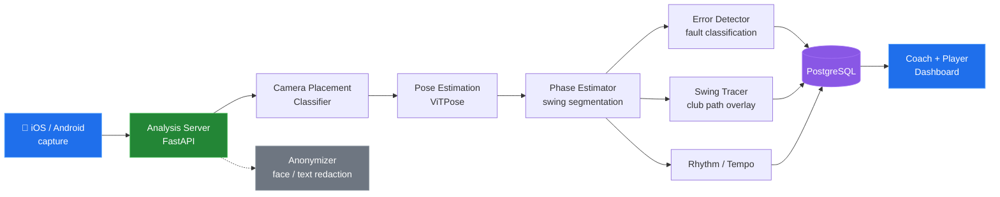

<h1 align="center">Hi, I'm Sagar Srivastava 👋</h1>

<p align="center">
  <a href="https://sagar-srivastava.com">
    
  </a>
</p>

<p align="center">
  <a href="https://sagar-srivastava.com"></a>
  <a href="https://linkedin.com/in/sagar-srivastavaa"></a>
  <a href="mailto:sagar.sriv.47@gmail.com"></a>
  
</p>

---

I build **end-to-end computer vision systems** — from training custom Vision Transformers to running them behind autoscaling Kubernetes clusters. Right now I lead the backend and AI architecture for a professional-grade golf swing analysis platform.

- 🏌️ **Currently** — CV/ML Engineer at [GolfWiz.ai](https://golfwiz.ai), owning the analysis pipeline end to end
- 🔬 **Research** — Arbitrary-shaped scene text detection (87.6% F-score) and GANs for facial de-identification at IIT (BHU)
- 🎨 **Previously** — KeshcutAI: virtual try-on with Stable Diffusion + LoRA and template-based pose alignment
- 📫 **Reach me** — [sagar.sriv.47@gmail.com](mailto:sagar.sriv.47@gmail.com)

---

## 🏌️ What I'm building at GolfWiz.ai

> Most of my day-to-day work lives in the private [`golfwiz-ai`](https://github.com/golfwiz-ai) org, so it won't show up as public repos. What follows is the shape of the system I work on. The volume behind it is visible in the contribution graph below — private contributions included.

A single uploaded swing video fans out through a chain of services I designed and maintain:



<details>
<summary><b>🧠 The ML services</b> — click to expand</summary>

<br/>

| Service | What it does |
| :--- | :--- |
| **Phase Estimator** | Segments a swing into its canonical phases (address → takeaway → top → impact → follow-through) so every downstream model reasons over aligned frames. |
| **Error Detector** | Multi-label fault classification against a structured error taxonomy — the model behind the coaching feedback users actually read. |
| **Swing Tracer** | Frame-accurate club-head tracking and path overlay rendered back onto the source video. |
| **Rhythm & Tempo** | Derives backswing:downswing ratios and tempo metrics from phase boundaries. |
| **Camera Placement Classifier** | Gates the pipeline early — rejects unusable angles before expensive inference runs. |
| **ViTPose (adapted)** | Pose backbone tuned for golf-specific keypoints, including a custom hip-keypoint training set. |
| **Anonymizer** | Privacy-first face/text/shaft redaction for videos used in training and research. |

</details>

<details>
<summary><b>⚙️ The platform underneath</b> — click to expand</summary>

<br/>

- **Serving** — FastAPI services on Kubernetes, split between a production server and a dedicated analysis fleet so heavy inference never blocks the API
- **CD** — GitOps-driven continuous delivery into the production cluster
- **Data** — PostgreSQL schema and models shared across services as a versioned submodule
- **Testing** — a dedicated pytest suite mounted into the server as a submodule
- **Clients** — native iOS and Android apps, plus web tools for grip classification, stance correction, and swing sharing
- **Internal tooling** — an annotators' dashboard and grip annotator that keep the training-data loop turning

</details>

<details>
<summary><b>📊 Where my commits actually go</b> — click to expand</summary>

<br/>

Last 12 months, by repository — the long tail of a system you own end to end:

```text
Server_Production   ████████████████████████████  1279
Server              █████████                      405
Error_Detector      ████████                       388
Server_utils        ██████                         271
Swing_Tracer        ████                           204
Phase_Estimator     ████                           184
golfwiz_android     ███                            158
Dashboard-frontend  ███                            151
Dashboard-server    ███                            137
db                  █                               81
golfwiz-ios-app     █                               72
models              ░                               35
```

</details>

---

## 🛠 Tech Stack

<p align="center">
  
  <br/>
  
</p>

<details>
<summary><b>Full breakdown</b></summary>

<br/>

**ML & Computer Vision**


**Backend & Infrastructure**


**Observability & Analysis**


</details>

---

## 📈 Activity

<p align="center">
  
</p>

<p align="center">
  
  
</p>

<p align="center">
  
</p>

<p align="center"><sub>
  These cards are generated daily by <a href="./.github/workflows/stats.yml">a GitHub Action</a> in this repo
  using my own token — so unlike the shared public card services they include private contributions,
  and they can't go down when someone else's rate limit runs out.
</sub></p>

---

## 🏆 Education & Achievements

- 🎓 **IIT (BHU) Varanasi** — B.Tech, Mechanical Engineering · CPI 8.44
- 🥈 **Kshitij 2024, IIT Kharagpur** — Runner-up, Data Science Hackathon
- 📝 **GATE DA 2024** — AIR 3736
- 🤖 **Tech Lead**, RoboReg Robotics Club, IIT BHU

---

<p align="center">
  <a href="https://sagar-srivastava.com"></a>
  <a href="https://linkedin.com/in/sagar-srivastavaa"></a>
  <a href="mailto:sagar.sriv.47@gmail.com"></a>
  <a href="https://instagram.com/still_sagar"></a>
</p>

<p align="center"><em>"If you can't measure it, you can't improve it."</em></p>
